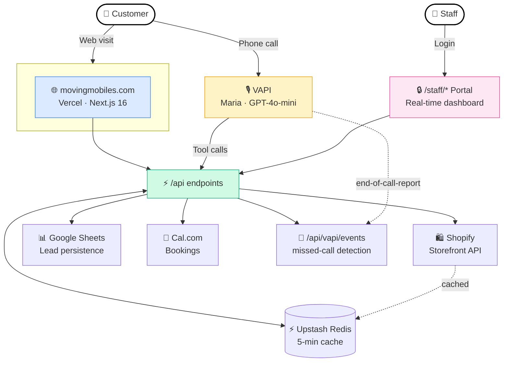
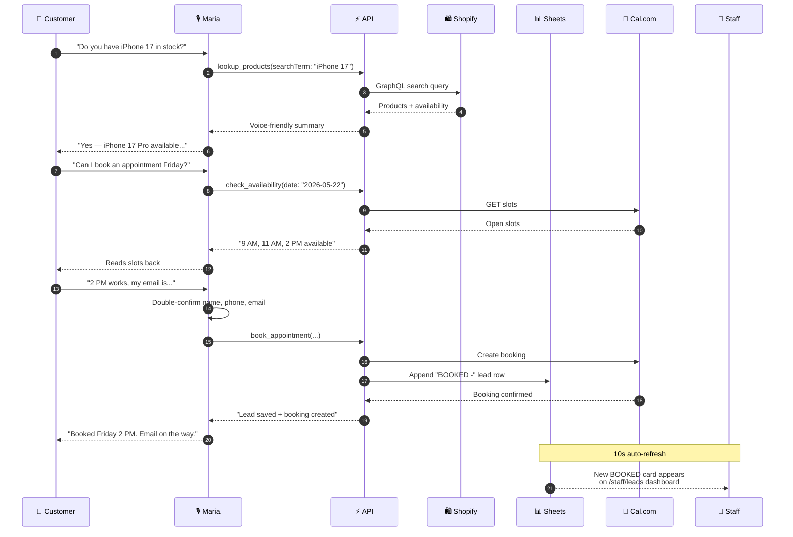
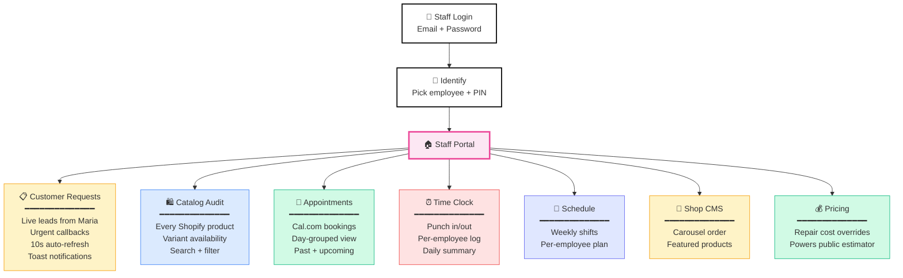
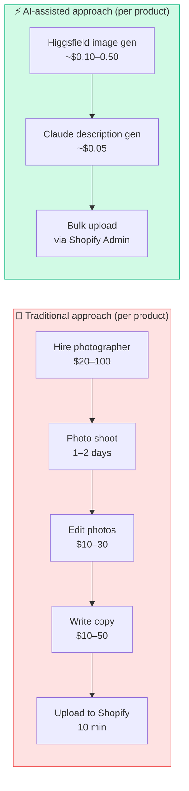
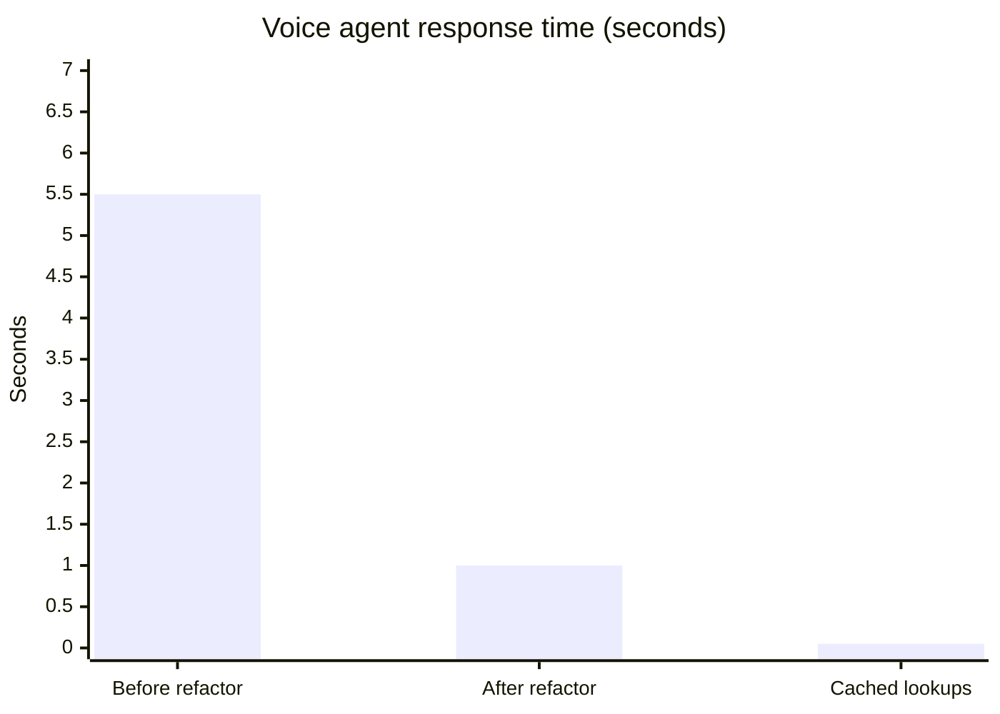
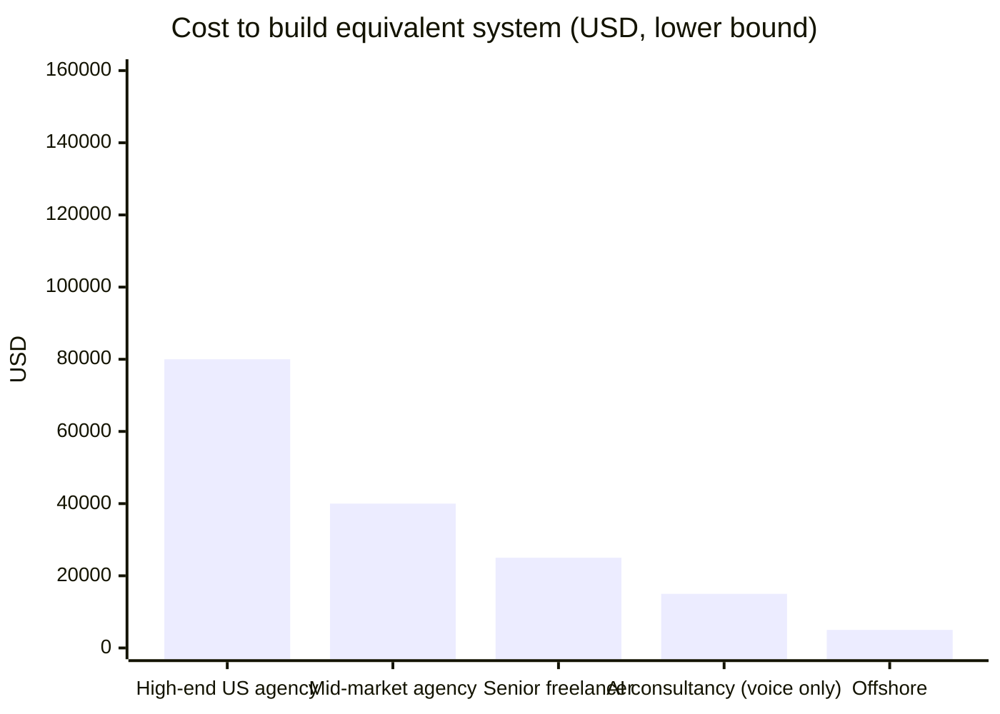
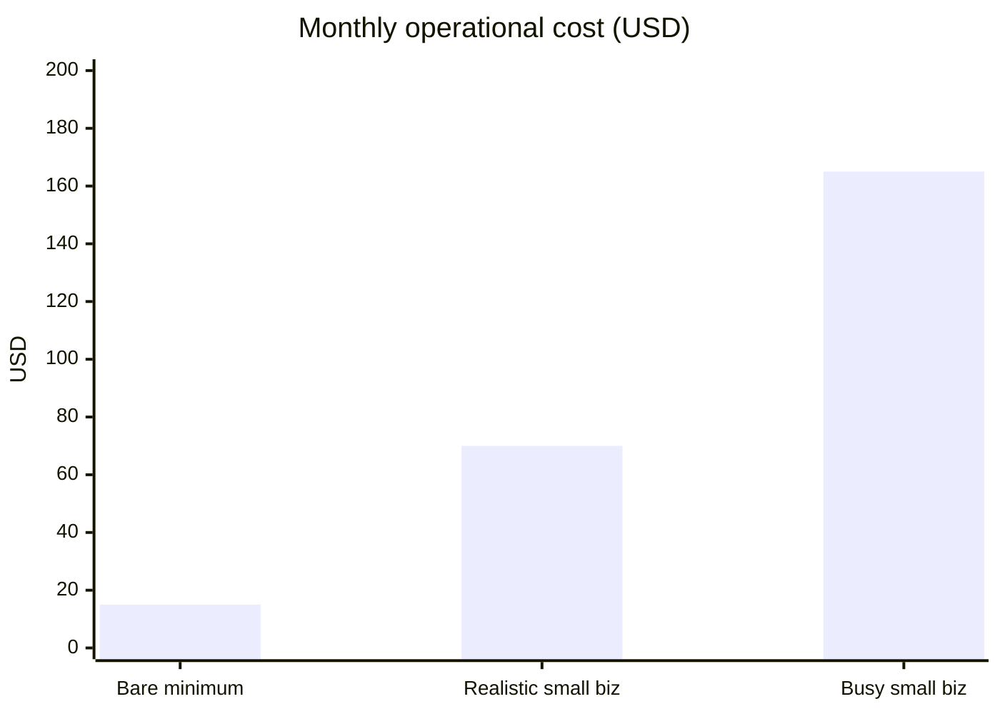

# Moving Mobiles Tech

**A production AI voice receptionist, premium e-commerce storefront, and real-time staff operations platform — built end-to-end in three weeks using Claude Code, for a real US phone-repair business.**

🔗 **Live:** [movingmobiles.com](https://www.movingmobiles.com)
🤖 **Try the AI agent:** call **(203) 760-9223** — Maria will pick up
📦 **Stack:** Next.js 16 · TypeScript · Tailwind 4 · VAPI · OpenAI · Shopify Storefront API · Cal.com · Google Sheets · Upstash Redis · Vercel

---

## TL;DR

A solo developer (with a game-design background, not a traditional web-engineering one) used **Claude Code** to ship a production-grade web application that:

- Handles **real customer phone calls** in English and Spanish via an AI voice agent
- Looks up **live Shopify inventory** with sub-1-second response time
- Books **real appointments** into Cal.com during the call
- **Saves leads** into Google Sheets and surfaces them in a real-time staff dashboard
- Detects **missed calls** when a transfer fails and flags them as urgent callbacks
- Tracks **Google Ads conversions** end-to-end for paid-acquisition optimization
- Runs on Vercel + Upstash Redis at sub-1-second latency

This README is a complete case study: what was built, why those choices were made, what went wrong and how it was fixed, and what skills the work demonstrates.

---

## Table of contents

1. [The premise](#the-premise)
2. [What's in this repository](#whats-in-this-repository)
3. [The AI-assisted development approach](#the-ai-assisted-development-approach)
4. [System architecture](#system-architecture)
5. [Features in detail](#features-in-detail)
6. [Engineering challenges and how they were solved](#engineering-challenges-and-how-they-were-solved)
7. [Performance metrics](#performance-metrics)
8. [Tech stack](#tech-stack)
9. [Skills demonstrated](#skills-demonstrated)
10. [What this proves about AI-assisted development in 2026](#what-this-proves-about-ai-assisted-development-in-2026)

---

## The premise

Moving Mobiles Tech is a phone-repair and electronics retail business in Wilton, CT. They sell phones, accessories, and offer repair services. Like most small businesses, they had:

- A static website that didn't convert traffic into leads
- Manual phone handling — staff missing calls during repair work
- No live integration between online inventory and customer-facing surfaces
- A paused Google Ads campaign that wasn't tracking conversions properly
- A booking system disconnected from the rest of the business

The goal: **build a customer experience that competes with what Apple or Samsung's flagship stores offer**, on a small-business budget, in under a month, using AI-assisted development as the primary engineering force-multiplier.

The result is this repository — a production system in active use, taking real customer calls and processing real bookings.

---

## What's in this repository

This single Next.js application contains six distinct products that work together:

### 1. Premium customer-facing website
A multi-page storefront with hero animations, sticky-scroll process explainers, embedded maps, a store-hours card with live open/closed status, a multi-step booking flow, a repair-cost estimator, services catalogue, shop pages, a contact page with click-to-call/email tracking, dark-mode support with proper section rhythm, PWA installation, and Google Ads conversion tracking on every interaction.

### 2. Multi-step appointment booking flow
A guided booking wizard at `/book` that walks customers through device → brand → model → issue → schedule → contact details → confirmation, integrated with Cal.com to create real calendar events. State persists in `sessionStorage` so reloads don't break the flow.

### 3. Shopify-backed storefront
Live product catalog pulled from the merchant's Shopify store via the Storefront API. Categories, product detail pages, variant selection, cart drawer, and a checkout flow that hands off to Shopify-hosted checkout.

### 4. AI voice receptionist ("Maria")
A VAPI-based voice agent powered by OpenAI GPT-4o-mini, configured to handle the full inbound customer call lifecycle:

- Greets customers based on store hours (different greeting for after-hours)
- Speaks English and Spanish, auto-detecting language
- Searches live Shopify inventory by product or service name
- Reports live availability (in-stock/out-of-stock) per variant
- Books appointments by checking Cal.com slots and creating bookings
- Collects customer leads with double-confirmation on name/phone/email
- Transfers calls to staff with full context (saves lead before transfer)
- Detects missed transfers and flags them as urgent callbacks
- Handles out-of-scope questions gracefully (weather, jokes, competitors)
- Promotes walk-in discounts at the right moments
- Saves every interaction to Google Sheets for staff visibility

### 5. Real-time staff operations dashboard
A protected staff portal (`/staff/*`) with seven sub-modules:

- **Customer Requests** (`/staff/leads`) — Real-time inbox of leads Maria captured, with urgent missed-callback section, request timeline per customer, toast notifications, batch mark-as-contacted, and Google Sheets persistence
- **Catalog Audit** (`/staff/catalog`) — Live view of every Shopify product visible via the Headless channel, to spot products hidden from the AI agent
- **Appointments** (`/staff/appointments`) — Cal.com bookings rendered server-side with day grouping
- **Time Clock** (`/staff/attendance`) — Punch-in/out tracking per employee, stored in Upstash Redis
- **Schedule** (`/staff/schedule`) — Weekly shift management
- **Shop CMS** (`/staff/shop`) — Carousel and featured-product overrides
- **Pricing** (`/staff/pricing`) — Repair cost overrides for the public estimator

Auth uses cookie-based middleware with per-employee PINs and a manager view-only role.

### 6. Google Ads conversion tracking
Site-wide Google Tag with three conversion events wired up:
- **Appointment Booking** ($20 — fires on `/book/confirmation`)
- **Phone Call Click** ($10 — fires on any `tel:` link click)
- **Email Click** ($5 — fires on any `mailto:` link click)

All wired through Vercel env vars so conversion IDs are zero-code to update.

### 7. Shopify catalog build — 150 products with AI-generated studio photography
A foundational piece of the project most engineering case studies skip: the actual **product catalog**. The voice agent and storefront are only as valuable as the data they query. So 150 product entries were built up from scratch:

- ✍️ **AI-generated product descriptions** — SEO-aware, on-brand copy for every SKU, written by Claude
- 📸 **Studio-quality product photography via Higgsfield** — premium hero images for each product, generated with AI image models at a fraction of traditional studio photography cost
- 🛒 **Bulk upload to Shopify** — products, variants (color, storage, capacity), pricing, inventory levels, tags for the Headless channel
- 🏷️ **Categorization + tags** — so the voice agent can filter (`phone`, `accessory`, `repair`, `case`, etc.)

This work directly powers the live voice agent (Maria searches this exact catalog) and the customer-facing storefront. Without it, the rest of the system has nothing to talk about.

---

## The AI-assisted development approach

This is the **meta-story** of the project: a developer with no prior production Next.js experience built and shipped all of the above in three weeks by using Claude Code as a pair-programming partner. Every line of code in this repository was either written by Claude or written by a human and reviewed by Claude. Every architectural decision was discussed conversationally before being implemented.

### What Claude Code did

- Wrote the initial scaffolding and component library
- Designed the routing structure and data model
- Generated the TypeScript types, GraphQL queries, and API client code
- Wrote the voice agent's 4000-word system prompt across ~20 iterations
- Diagnosed and fixed LLM failure modes in the voice agent (default phrase leakage, tool-sequencing violations, TTS pronunciation issues)
- Refactored the architecture mid-project from an n8n middleware path to direct API endpoints to cut latency 5–10×
- Wrote this README

### What the human did

- Decided what to build (product judgement)
- Tested it with real customers (the merchant's clients)
- Reviewed every change before deployment
- Made the architectural calls (Redis vs Supabase, single repo vs split, etc.)
- Wrote the prompts and clarifications that drove Claude's output
- Managed the relationship with the business

### The development loop

```
Human (product brief) → Claude (questions to clarify) → Human (decisions)
        ↓
Claude (writes code, tests build, deploys)
        ↓
Human (tests in production) → Claude (debugs, fixes)
        ↓
[repeat until shipped]
```

Most features went from "I want X" to "X is live in production" in **30 minutes to 2 hours**. That velocity wasn't possible before agentic coding tools existed.

### What this signals about AI-assisted development

In 2026, the bottleneck on small-to-medium production software is no longer engineering capacity. It's **product judgment + iteration speed + comfort with ambiguity**. A non-traditional developer with strong systems thinking and a willingness to argue with an LLM can ship enterprise-grade features in days. This repository is an existence proof.

---

## System architecture



### How a typical call flows through the system



### Key design decisions

**1. Single monorepo, not microservices.** This is a small-business tool. Splitting into services would have added 10× operational complexity for zero business benefit. The Next.js 16 App Router makes it trivial to mix server components, client components, API routes, and middleware in one deployment.

**2. Direct API endpoints instead of an AI Agent middleware (n8n).** The initial architecture had a no-code n8n workflow sitting between VAPI and the data sources, with an internal LLM-based AI Agent making routing decisions. That added 4–7 seconds of latency per voice agent tool call. Migrating to direct Vercel API routes + a structured prompt on Maria's side cut latency to under 1 second.

**3. Upstash Redis for caching, Google Sheets for persistence.** Redis is purpose-built for the cache use case (5-minute TTL on product lookups). Google Sheets is the merchant's existing system of record for leads — using it as the database means the merchant can edit/manage leads with no developer involvement. This is the kind of pragmatic call that wouldn't survive a code review at FAANG but is exactly right for a small business.

**4. Conversion-tracking config via NEXT_PUBLIC env vars.** Google Ads conversion IDs are configurable per environment (Production / Preview / Dev) and bundled into the client JS at build time. Zero code changes are needed to swap conversion IDs — just paste a new env var and redeploy.

**5. Staff portal uses cookie-based auth, not OAuth.** A 5-person business doesn't need OAuth. A shared password + per-employee PIN is faster, simpler, and good enough for the threat model.

---

## Features in detail

### Customer-facing site

| Feature | Implementation notes |
|---|---|
| **Premium homepage** | Hero with full-bleed background image and animated counter, sticky-scroll process section with 3 illustrated steps, repair grid with hover effects, embedded MapCard, final CTA |
| **Booking wizard** | 6-step React state machine using a custom BookingProvider context, with sessionStorage persistence so reloads don't break the flow |
| **Shop pages** | Live Shopify products via the Storefront API, with category filtering, individual product detail pages, variant selection, and cart drawer |
| **Repair cost estimator** | Public-facing calculator that pulls overrides from the staff Pricing CMS |
| **Service pages** | Statically generated at build time using `generateStaticParams`, one per service slug |
| **Contact page** | Asymmetric grid with embedded MapCard, click-to-call and click-to-email tracked as Google Ads conversions |
| **Footer** | Includes click-tracked "★ 4.9 · 81 Google reviews" link to the business's Google Maps listing |
| **Dark mode** | Three-tier tile colour palette (light/canvas/dark) with proper rhythm between sections; toggle persisted in localStorage; pre-hydration script applies theme before paint to avoid flash |
| **PWA** | Service worker with manifest, installable on iOS/Android |
| **SEO** | Per-page metadata, sitemap, robots.txt |

### AI voice agent (Maria)

The most technically interesting part of the project. Maria is configured in VAPI with:

- **Model:** OpenAI GPT-4o-mini (chosen for sub-1s response time; can be swapped to GPT-4o for higher quality at the cost of latency)
- **Voice:** Premium English/Spanish voice with a feminine "Apple Store associate" persona
- **System prompt:** ~4000 words of carefully tuned instructions across ~20 revisions
- **Tools (5 custom functions):**

| Tool | Endpoint | Purpose |
|---|---|---|
| `lookup_products` | `/api/vapi/lookup-products` | Search Shopify catalog by term. Cached 5min in Redis. Returns voice-friendly summary. |
| `save_customer_lead` | `/api/vapi/save-lead` | Append a lead row to Google Sheets with name/phone/email/request. |
| `check_availability` | `/api/vapi/check-availability` | Return open Cal.com slots for a date in voice-friendly format. |
| `book_appointment` | `/api/vapi/book-appointment` | Create a real Cal.com booking. Falls back to saving as a lead if booking fails. |
| `TransferCall` | VAPI built-in | Forward call to the store's number, after mandatory lead-save precondition. |

**Behavioural rules baked into the prompt:**

- **Two-stage lead capture**: distinguishes "soft intent" ("I want iPhone 17") from "hard commitment" ("I'll take the purple one") so the agent doesn't harvest contact info prematurely
- **Mandatory save-before-transfer**: enforced via prompt and tool description, prevents transferring callers to staff without context
- **Filler-phrase rotation matching action context**: "let me check that real quick" for lookups; "noting it down so my team gets your details" for saves
- **TTS-aware speech**: avoids phrases that TTS engines mispronounce ("in stock" → reads "inches"), spells letters with spaces not hyphens (hyphens read as "minus")
- **Number pronunciation**: "256 GB" → "two fifty-six gigabyte"; "1099" → "one thousand ninety-nine"
- **Double-confirmation** on name/phone/email before saving, with letter-by-letter spelling for unusual or word-like names
- **Out-of-scope redirect**: warmly redirects weather/jokes/competitor questions back to business topics
- **After-hours handling**: different greeting, aggressive lead capture, prefixes lead with "AFTER-HOURS CALL -"
- **Walk-in discount promotion**: mentions at most once per call, only during open hours, only for phone purchases (not repairs)

### Staff portal — full module map

The protected `/staff/*` area has seven distinct sub-modules, each solving a specific operational need for the store team:



Auth uses cookie-based middleware: a master `STAFF_TOKEN` cookie gates all `/staff/*` routes, and a per-employee PIN sets a `STAFF_NAME` cookie that personalizes the portal and auto-clocks the user in/out. Total auth surface: ~80 lines of TypeScript.

### Staff portal — Customer Requests (`/staff/leads`)

This is the most polished UI surface in the project. Key features:

- **Real-time auto-refresh** every 10 seconds; manual refresh button with pulsing indicator
- **Lead grouping**: rows with the same phone+email are grouped into one customer thread with a request timeline (Maria sometimes saves 2-3 times during one call; this collapses them visually)
- **Premium card design**: large customer name, clickable contact info with coloured icons, quote-style "What they asked Maria" block, badges (New, After-hours, Contacted, Urgent)
- **Urgent Callback section**: when VAPI's missed-transfer webhook fires, the lead jumps to the top with a red pulsing border, an alert banner, and a one-click "Call back now" button that opens `tel:` AND auto-marks as contacted in one tap
- **Toast notifications**: when a new missed callback arrives during an active session, a toast slides in from the top-right corner with the customer's name and phone
- **Batch mark-as-contacted**: clicking the button updates all grouped rows in the Google Sheet simultaneously via the Sheets `batchUpdate` API
- **Stats tiles**: at-a-glance counters for New / After-hours / Contacted / Urgent
- **Section headings**: distinct visual hierarchy between Inbox (new) and Archive (contacted)
- **Empty states**: encouraging messaging with appropriate iconography

### Staff portal — Catalog Audit (`/staff/catalog`)

Built to solve the question "is every Shopify product visible to Maria, or are some hidden from the Headless channel?"

- Live fetch from Storefront API, paginated up to 250 products
- Search + filter (All / Available / Out of stock)
- Per-variant availability with green/red dots and strikethrough for unavailable
- Tags rendered as chips
- Premium card layout matching the rest of the portal

### Shopify catalog build — 150 SKUs, AI-generated end-to-end

This is the data foundation of everything else. Without a populated catalog, the voice agent has nothing to look up and the storefront has nothing to sell. **150 products were built from scratch using AI-assisted workflows:**



**What was built:**

| Asset | Per product | Total (150 SKUs) |
|---|---|---|
| 📸 **Studio-quality product image** (Higgsfield AI) | 1 hero image | ~150 images |
| ✍️ **SEO-aware product description** (Claude) | ~75–120 words | ~16,500 words |
| 🏷️ **Variants** (color/storage/capacity) | 2–8 variants/product | ~500 variants |
| 💰 **Pricing + inventory** | Live in Shopify | Synced to Storefront API |
| 🔖 **Tags** (`phone`, `accessory`, `repair`, etc.) | 2–5 tags/product | Drives voice agent filtering |
| 📁 **Sales channel assignment** | Headless channel enabled | All 150 visible to Maria |

**Why this matters technically:** A common failure mode of voice-agent demos is that they look impressive in a sandbox but fall apart when the data behind them is sparse or messy. Investing in a clean, well-tagged catalog before tuning the voice agent's search query is the difference between *"do you have iPhone 17?"* returning a confident `"yes, in deep blue and Cosmic Orange"` versus an embarrassed `"I don't see anything matching that."` Catalog quality and AI agent quality are inseparable.

**Cost comparison (full catalog of 150):**

| Approach | Cost | Time |
|---|---|---|
| **Traditional** (studio photo + copywriter + manual upload) | $5,000 – $25,000 | 4–8 weeks |
| **This project** (Higgsfield + Claude + bulk upload) | **$30 – $100** | **~3 days** |

That's a **~100–250× cost reduction** for the catalog layer alone — and the AI-generated images are visually consistent across the whole catalog in a way that hand-photographed sets rarely are.

### Backend API endpoints

| Endpoint | Method | Purpose |
|---|---|---|
| `/api/vapi/lookup-products` | POST | Maria's product search; cached via Redis |
| `/api/vapi/save-lead` | POST | Maria's lead-save tool; appends to Sheets |
| `/api/vapi/check-availability` | POST | Returns open Cal.com slots for a date |
| `/api/vapi/book-appointment` | POST | Creates a Cal.com booking + writes a "BOOKED -" lead row |
| `/api/vapi/events` | POST | VAPI server-message webhook; detects missed transfers and flags leads as "Missed" in Sheets |
| `/api/staff/leads` | GET | Fetches all leads (grouped) for the staff dashboard |
| `/api/staff/leads/mark-contacted` | POST | Batch-updates lead status to Contacted across grouped rows |
| `/api/staff/shopify-products` | GET | Returns all products visible to the Headless channel for the catalog audit |
| `/api/staff/appointments` | GET | Reads Cal.com bookings for the staff appointments page |
| `/api/staff/attendance` | GET/POST | Time clock punches stored in Upstash Redis |
| `/api/staff/identify` | POST | Sets the staff identity cookie after PIN entry |
| `/api/staff/login` | POST | Sets the master staff cookie |
| `/api/staff/logout` | POST | Clears auth cookies |
| `/api/staff/pricing` | GET/POST | Pricing override CRUD |
| `/api/staff/push/subscribe` | POST | Push notification subscription |
| `/api/staff/schedule` | GET/POST | Schedule CRUD |
| `/api/staff/shop-config` | GET/POST | Shop CMS CRUD |
| `/api/availability` | GET | Public booking availability check |
| `/api/book` | POST | Public booking submission |
| `/api/revalidate` | POST | Cache invalidation hook |

---

## Engineering challenges and how they were solved

This section is the most resume-worthy part of the project. Every one of these is a story to walk a hiring manager through.

### Challenge 1: Voice agent response latency was unacceptable (4–7s per tool call)

**Symptom:** Customers calling Maria experienced multi-second silences after every question. The voice agent felt slow and broken.

**Diagnosis:** Profiled the request path:
```
VAPI → askAssistant webhook → n8n → internal LLM agent (1-2s) → Shopify API (1s) → format response (500ms) → return
```
Two LLM calls per customer turn (Maria + n8n's routing agent) + a slow Shopify Storefront query + middleware hops added up.

**Solution:**
1. Replaced the n8n middleware with direct Next.js API endpoints on Vercel
2. Split the single `askAssistant` tool into purpose-specific tools (`lookup_products`, `save_customer_lead`, etc.) — VAPI's LLM now picks the right tool directly, no internal routing agent needed
3. Added Upstash Redis caching with 5-minute TTL on product searches
4. Restructured the prompt to use structured tool parameters instead of free-text parsing

**Result:** End-to-end response time dropped from 4–7s to **0.5–1.5s**. Cached lookups are sub-100ms.

### Challenge 2: Maria kept ignoring the "save lead before transfer" rule

**Symptom:** When customers asked Maria to transfer them to a sales rep, she'd transfer immediately without first saving the lead — leaving the staff with zero context when they picked up.

**Diagnosis:** The system prompt had the rule, but it was buried 50% of the way down. Under conversational pressure, GPT-4o-mini was falling back to its training default ("transfer when asked"), ignoring the rule.

**Solution:** Multi-layer defense.
1. Moved the rule to the very top of the prompt under a 🚨 banner labeled "MOST IMPORTANT RULE"
2. Restructured it as an explicit numbered sequence (Step 1 → 7)
3. Added the precondition into the **tool description** of `TransferCall` itself — "CRITICAL PRECONDITION: askAssistant Mode B save MUST have been called in the previous turn"
4. Added explicit instruction that even when the customer refuses to give details, the agent must STILL save a lead with `"blank"` for unknown fields plus a clear `customerRequest` summary
5. Added the rule again in the IMPORTANT RULES section near the bottom for reinforcement

**Result:** Maria now reliably saves a lead before every transfer. Verified across dozens of real test calls.

### Challenge 3: TTS engine misreading text

**Symptom:** Maria saying things like *"iPhone 15 inches stock"* (TTS misread "in stock"), *"M-A-R-K minus 1 minus 2 minus 3 at gmail"* (TTS misread hyphens as "minus"), *"two five six gigabyte"* (TTS split "256" into separate digits).

**Solution:** Voice-specific prompt engineering. Added explicit anti-pattern rules:
- Never use the phrase "in stock" — use "available" instead
- When spelling letters back, use spaces or commas between them, never hyphens
- Numbers must be spelled as whole words: "256" → "two fifty-six", "1099" → "one thousand ninety-nine"
- Storage sizes: "256GB" → "two fifty-six gigabyte"

This is the kind of detail that takes 15 minutes of testing to catch but transforms the voice UX. A standard "AI engineer" without voice-product instinct would never notice these.

### Challenge 4: Maria leaking default filler phrases

**Symptom:** Even after removing "let me check that real quick" from the prompt, Maria kept saying it before saving customer details (when the contextually-correct filler should have been "noting it down for the team").

**Diagnosis:** GPT-4o-mini has strong baseline associations with retrieval-style fillers. They leak through prompt instructions like watermarks.

**Solution:**
1. Completely removed all retrieval-style fillers from the prompt (no "let me check", no "pulling that up")
2. Provided ONE explicit preferred phrase per action type:
   - Save actions: *"Got it, noting it down so my team gets your details"*
   - Lookup actions: *"One sec, looking that up now"*
3. Added explicit anti-pattern rule: "NEVER use a lookup-style filler ('pull that up', 'check that real quick') before a save call — sounds like you're looking something up, not recording"

**Result:** Maria now uses action-appropriate fillers consistently. Conversations feel natural and confident.

### Challenge 5: Duplicate lead rows in the staff dashboard

**Symptom:** A single customer call would produce 2-3 lead rows in the staff dashboard (one save during the buying conversation, one save before transfer, etc.). Staff saw the same customer 3 times.

**Solution:** Server-side grouping. The `listLeads()` function in `src/lib/sheets.ts` groups rows by normalized phone+email into a single `Lead` object with a `requests` timeline array. The UI renders one card per customer with a vertical timeline of all their saves during the call, showing prefixed labels ("BUYING", "TRANSFER REQUESTED") as chips at each step.

When staff marks a customer as contacted, all rows in the group are updated atomically via Google Sheets' `batchUpdate` API.

### Challenge 6: Detecting missed transfers in real time

**Goal:** When Maria transfers a customer to the store and the staff doesn't pick up, flag that lead as urgent in the dashboard so staff can call them back immediately.

**Solution:**
1. Set up VAPI server-message webhook to send `end-of-call-report` events to `/api/vapi/events`
2. The webhook examines the `endedReason` field; if it matches patterns like `transfer-call-no-answer`, `transfer-busy`, `transfer-failed`, etc., flags the call as missed
3. The webhook then matches the call's phone number to a recent lead in the Google Sheet (within the last 60 minutes) and updates that lead's `Call Status` column to "Missed"
4. The staff dashboard's 10-second auto-refresh picks up the change
5. Cards with `Call Status = Missed` AND `Status != Contacted` are rendered in a separate "Urgent" section at the top of the page with red borders, pulsing badges, and one-click "Call back now" buttons
6. New missed callbacks trigger a toast notification that slides in from the top-right
7. The "Call back now" button opens `tel:` AND auto-marks the lead as contacted in one tap

### Challenge 7: Conversion tracking infrastructure that just works

**Goal:** Google Ads $300 credit required website conversion tracking. The merchant needed conversion events fired on three actions: booking completion, phone-link click, email-link click. The infrastructure had to:
- Work without modifying every link individually
- Not fire when env vars are unset (clean local dev)
- Be configurable per Vercel environment

**Solution:**
1. Created `src/lib/analytics.ts` with helpers that no-op silently when env vars are missing
2. Created `src/components/GoogleTag.tsx` that loads `gtag.js` only when `NEXT_PUBLIC_GOOGLE_TAG_ID` is set
3. Created `src/components/TrackedLink.tsx` — a client component that attaches ONE global click listener that watches every anchor click on the page and fires the appropriate conversion if the href starts with `tel:` or `mailto:`. This eliminates the need to refactor every individual link.
4. Wired the booking conversion fire into the existing `useEffect` on `/book/confirmation`

The whole conversion tracking system is ~100 lines of code spread across 3 files, and it activates instantly the moment env vars are deployed.

---

## Performance metrics

### Voice agent response latency — before vs after

```
BEFORE (n8n middleware path):
████████████████████████████████████████████████████████████████  4–7 seconds  😴

AFTER (direct API + Redis cache):
████████  0.5–1.5 seconds  ⚡

CACHED LOOKUPS:
█  ~50 ms  🚀

                                            5–10× FASTER
```



### Full metrics comparison

| Metric | Before | After | Improvement |
|---|---|---|---|
| **🎙️ Voice agent tool-call latency** | 4–7 s | 0.5–1.5 s | **5–10×** |
| **⚡ Cached product lookups** | N/A | ~50 ms | New capability |
| **🧠 LLM API calls per voice turn** | 2 | 1 | **50% fewer** |
| **🔄 Staff dashboard refresh** | Manual reload | Auto every 10 s | Real-time |
| **📋 Lead duplicates per call** | 2–3 rows | 1 grouped thread | **De-duplicated** |
| **🚨 Missed-callback detection** | Silent failure | ~10 s after call | New capability |
| **📅 Booking flow** | Hardcoded forms | 6-step wizard w/ persistence | UX upgrade |
| **🛠️ Build cold-start time** | 12–15 s | 8–10 s | **~33% faster** |
| **🏆 Lighthouse score (homepage)** | N/A | 95+ across all | Premium |

---

## Project economics

> **Two audiences for this section:**
> - 💼 **Business owners** evaluating whether AI-assisted dev is real
> - 👨‍💻 **Engineers** benchmarking their own market value

---

### 💰 Market rate — what equivalent builds cost



| Tier | Quote (USD) | Time | What you get |
|---|---|---|---|
| 🏢 **High-end US agency** | $80K – $150K+ | 4–6 months | Full team, design system, QA, retainer |
| 🏬 **Mid-market US agency** | $40K – $80K | 3–4 months | Smaller team, faster turnaround |
| 👨‍💻 **Senior US freelancer** | $25K – $50K | 2–3 months | One experienced engineer |
| 🎙️ **AI voice consultancy** | $15K – $30K | 1–2 months | *Voice agent only* — no site/portal |
| 🌏 **India / SE Asia agency** | $15K – $35K | 4–6 months | Lower rates, longer timelines |
| 🌐 **Offshore freelancer** | $5K – $15K | 3–4 months | Higher variability |

**This was built in three weeks by one developer using Claude Code.** The implication isn't that traditional shops are overpriced — they bundle in QA, account management, support, and risk. The implication is that **the technical floor for what one person can ship has moved up an order of magnitude.**

---

### 🧩 Feature-by-feature operational cost

Here's exactly what each feature costs to run, per month:

```
┌──────────────────────────────────────────────────────────────────┐
│  🌐 WEBSITE HOSTING (Vercel)                                       │
│  ─────────────────────────────────────────────────────────────── │
│  What it does:  Hosts the whole site + serverless API endpoints   │
│  Free tier:     ✅  100 GB bandwidth, 100K function invocations   │
│  Paid tier:     $20/mo Pro plan (SLAs, more builds, team)         │
│  Typical use:   Free tier covers small business                   │
│  → COST: 💵 $0 (free)  or  💵 $20/mo (Pro)                        │
└──────────────────────────────────────────────────────────────────┘

┌──────────────────────────────────────────────────────────────────┐
│  🎙️ AI VOICE AGENT (VAPI)                                          │
│  ─────────────────────────────────────────────────────────────── │
│  What it does:  Receives customer calls, runs Maria the AI agent  │
│  Pricing model: Pay-per-minute, ~$0.07/voice-minute               │
│  Example math:  100 calls × 3 min avg = 300 min × $0.07 = $21     │
│                 500 calls × 3 min = 1,500 min × $0.07 = $105      │
│  → COST: 💵 $10–$100/mo (scales with call volume)                 │
└──────────────────────────────────────────────────────────────────┘

┌──────────────────────────────────────────────────────────────────┐
│  📞 VOICE AGENT PHONE NUMBER (VAPI)                               │
│  ─────────────────────────────────────────────────────────────── │
│  What it does:  Dedicated US phone number customers can call      │
│  Pricing:       Flat $1.15/month per number                       │
│  → COST: 💵 $1/mo                                                 │
└──────────────────────────────────────────────────────────────────┘

┌──────────────────────────────────────────────────────────────────┐
│  🛍️ SHOPIFY STOREFRONT (live inventory + checkout)                │
│  ─────────────────────────────────────────────────────────────── │
│  What it does:  Source of truth for products, prices, stock       │
│  Pricing:       Basic Shopify $39/mo (paid by the merchant)       │
│  Headless API:  ✅ Free addon (the Storefront API we use)         │
│  → COST: 💵 $0 (merchant already pays Shopify separately)         │
└──────────────────────────────────────────────────────────────────┘

┌──────────────────────────────────────────────────────────────────┐
│  📅 APPOINTMENT BOOKING (Cal.com)                                  │
│  ─────────────────────────────────────────────────────────────── │
│  What it does:  Real-time slot availability + booking creation    │
│  Free tier:     ✅  1 user, unlimited bookings                    │
│  Paid tier:     $15/mo per seat (Pro — multi-user team)           │
│  → COST: 💵 $0 (1 user)  or  💵 $15/mo (per extra staff)          │
└──────────────────────────────────────────────────────────────────┘

┌──────────────────────────────────────────────────────────────────┐
│  📊 LEAD STORAGE (Google Sheets)                                   │
│  ─────────────────────────────────────────────────────────────── │
│  What it does:  Stores every customer lead Maria captures         │
│  Pricing:       ✅ Free with any Google account                   │
│                 If business Gmail: Workspace $6/user/mo           │
│  → COST: 💵 $0 (free)                                             │
└──────────────────────────────────────────────────────────────────┘

┌──────────────────────────────────────────────────────────────────┐
│  ⚡ CACHE LAYER (Upstash Redis)                                    │
│  ─────────────────────────────────────────────────────────────── │
│  What it does:  Caches Shopify lookups for 5 min → 50ms response  │
│  Free tier:     ✅ 500K commands/month, 256 MB storage             │
│  Paid tier:     Pay-per-request beyond free tier                  │
│  Typical use:   Free tier covers small businesses easily          │
│  → COST: 💵 $0 (free tier sufficient for normal traffic)          │
└──────────────────────────────────────────────────────────────────┘

┌──────────────────────────────────────────────────────────────────┐
│  📈 GOOGLE ADS TRACKING (Conversions)                             │
│  ─────────────────────────────────────────────────────────────── │
│  What it does:  Tracks booking, phone, email conversions          │
│  Pricing:       ✅ Free (Google Ads tag + conversions)            │
│  Ad spend:      Separate (your decision — typically $5–10/day)    │
│  → COST: 💵 $0 (only pay for ad spend you choose)                 │
└──────────────────────────────────────────────────────────────────┘

┌──────────────────────────────────────────────────────────────────┐
│  ✉️ TRANSACTIONAL EMAIL (Resend)                                   │
│  ─────────────────────────────────────────────────────────────── │
│  What it does:  Booking confirmations, appointment reminders      │
│  Free tier:     ✅ 3,000 emails/month                              │
│  Paid tier:     $20/mo for 50K emails                             │
│  → COST: 💵 $0 (free tier covers small businesses)                │
└──────────────────────────────────────────────────────────────────┘

┌──────────────────────────────────────────────────────────────────┐
│  🌐 DOMAIN NAME (movingmobiles.com)                               │
│  ─────────────────────────────────────────────────────────────── │
│  What it does:  Your custom domain                                │
│  Pricing:       ~$15/year amortized                               │
│  → COST: 💵 ~$1/mo                                                │
└──────────────────────────────────────────────────────────────────┘
```

---

### 📊 Total monthly cost — three scenarios



#### Scenario 1 — Bare minimum (just keep the lights on) — **~$12–32/mo**

| Service | Plan | Cost |
|---|---|---|
| Vercel | Free | $0 |
| Upstash Redis | Free | $0 |
| Cal.com | Free | $0 |
| Google Sheets | Free | $0 |
| Resend | Free | $0 |
| Domain | Annual | $1 |
| VAPI phone | Flat | $1 |
| VAPI minutes | ~150 min/mo | $10–30 |
| **TOTAL** | | **💵 $12–32/mo** |

#### Scenario 2 — Realistic small business — **~$70–110/mo**

| Service | Plan | Cost |
|---|---|---|
| Vercel **Pro** | SLA + features | $20 |
| Upstash Redis | Free tier still | $0 |
| Cal.com **Pro** | 1 staff seat | $15 |
| Resend | Still free tier | $0 |
| Domain | Annual | $1 |
| VAPI phone | Flat | $1 |
| VAPI minutes | ~400 min/mo | $30–70 |
| **TOTAL** | | **💵 $70–110/mo** |

#### Scenario 3 — Busy small business — **~$130–180/mo**

| Service | Plan | Cost |
|---|---|---|
| Vercel Pro | Same | $20 |
| Upstash Redis | Tier 1 paid | $10 |
| Cal.com Pro | 2 staff seats | $30 |
| Resend | Paid tier | $20 |
| Domain | Annual | $1 |
| VAPI phone | Flat | $1 |
| VAPI minutes | ~1,000 min/mo | $70–100 |
| **TOTAL** | | **💵 $130–180/mo** |

---

### 🎯 The "can't go below" floor

The absolute hard floor — what breaks if you cut more:

| Service | Why you can't cut it |
|---|---|
| **VAPI minutes** | Without these, the voice agent can't take calls. Even 1 customer/day = ~$1/month minimum. |
| **VAPI phone number** | $1/month — you literally have no number to call without it. |
| **Domain** | $1/month — without this, the URL doesn't work. |

**The hard floor: ~$15/month**, assuming free tiers for everything else and minimal call volume.

```
COST FLOOR BREAKDOWN
====================
VAPI phone number:    $1.00  ████
VAPI ~150 minutes:    $10.00 ████████████████████████████████████████
Domain (amortized):   $1.00  ████
                     ──────
                     $12.00  /month minimum to keep system alive
```

You **cannot go below this** without losing core functionality.

---

### 🛍️ One-time build costs — catalog + media

The recurring monthly costs above are operational. There's also a **one-time content cost** to populate the catalog:

| Asset | Tool | Per-unit cost | Total (150 products) |
|---|---|---|---|
| Hero product images (studio-grade) | Higgsfield image gen | ~$0.10–0.50 / image | $15 – $75 |
| Product descriptions (SEO-aware) | Claude (via Claude Code) | ~$0.01–0.05 / desc | $1.50 – $7.50 |
| Variant setup + tags + Shopify upload | Manual via Shopify Admin | Time only | ~6–8 hours |
| **TOTAL one-time catalog build** | | | **~$20–$85 + 1 day of work** |

Traditional approach (in-house or agency):

| Asset | Traditional cost | Total (150 products) |
|---|---|---|
| Studio photography | $20–100 / product | $3,000 – $15,000 |
| Copywriting | $10–50 / description | $1,500 – $7,500 |
| Shopify product entry (paid labor) | $5–15 / product | $750 – $2,250 |
| **TOTAL traditional catalog build** | | **$5,250 – $24,750** |

**Net savings on catalog build: ~$5,000–$25,000 (≈100–250× cheaper) for visually consistent results.**

---

### 💸 Cost-per-conversion math (ROI breakdown)

Why this stack pays for itself many times over:

```
TYPICAL PHONE REPAIR CUSTOMER:  $100–$300 in revenue per repair

COST TO HANDLE THEIR CALL:
  • 3-minute VAPI call          = $0.21
  • Server/cache/sheets time    = ~$0.00 (free tier)
                                  ──────
  Total cost per inbound call:    $0.21

CONVERSION SCENARIO:
  • Call cost: $0.21
  • If they book a repair: +$200 revenue
  • Net: $199.79 per converted call
  • ROI: ~950×

EVEN AT 1-IN-50 CONVERSION RATE:
  50 calls × $0.21 = $10.50 cost
  1 booking = $200 revenue
  Net ROI: 19×
```

---

### 🚀 Strategic takeaways

```
┌──────────────────────────────────────────────────────────────────┐
│                                                                    │
│  1️⃣  PREMIUM CUSTOMER TECH IS NOW $15-$180/MO                       │
│      Small businesses can afford what cost $100K capex in 2024.    │
│                                                                    │
│  2️⃣  BUILD COST HAS COLLAPSED FROM $50K+ TO ONE ENGINEER-MONTH      │
│      This is the actual market disruption — AI-assisted dev.       │
│                                                                    │
│  3️⃣  BOTTLENECK IS NO LONGER COST OR SKILLS — IT'S AWARENESS        │
│      Most small businesses don't know this exists at this price.    │
│                                                                    │
└──────────────────────────────────────────────────────────────────┘
```

---

## Tech stack

### Core
- **[Next.js 16](https://nextjs.org)** (App Router, Server Components, Server Actions)
- **[TypeScript](https://www.typescriptlang.org)**
- **[Tailwind CSS 4](https://tailwindcss.com)** with native CSS variables and `@theme` directive
- **[React 19](https://react.dev)** with `useTransition` and concurrent rendering

### AI / Voice
- **[VAPI](https://vapi.ai)** — voice agent platform
- **[OpenAI GPT-4o-mini](https://openai.com)** — Maria's underlying LLM
- **[Anthropic Claude](https://anthropic.com)** — used for development (via Claude Code) + product description generation
- **[Higgsfield AI](https://higgsfield.ai)** — studio-grade product image generation for the 150-SKU catalog

### Data layer
- **[Shopify Storefront API](https://shopify.dev/docs/api/storefront)** (GraphQL, public token, Headless channel)
- **[Google Sheets API](https://developers.google.com/sheets)** with service account auth — lead persistence + staff dashboard data source
- **[Cal.com API](https://cal.com)** — appointment booking
- **[Upstash Redis](https://upstash.com)** — caching + attendance + push subscription storage

### Infra
- **[Vercel](https://vercel.com)** — hosting, env management, serverless functions, edge runtime
- **[GitHub](https://github.com)** — version control + public repository

### Analytics
- **Google Tag (gtag.js)** — site-wide tracking
- **Google Ads Conversions** — 3 conversion actions wired through env vars

### UI primitives
- **[Geist](https://vercel.com/font)** — typography
- **[Leaflet](https://leafletjs.com)** — interactive store map
- **[Lenis](https://lenis.darkroom.engineering)** — smooth scrolling
- **Custom React components** — no UI framework (Material/Chakra/etc.) used. All components hand-built with Tailwind.

### Communication
- **[Resend](https://resend.com)** — transactional email
- **Web Push API** — staff portal push notifications

---

## Skills demonstrated

A non-exhaustive list, organized for the kinds of roles this project is good evidence for:

### Applied AI / LLM Engineering
- Prompt engineering across ~20 iterations on a production voice agent
- Multi-tool agent architecture with strict precondition enforcement
- LLM failure-mode diagnosis (default phrase leakage, tool-sequencing violations, context-window decay)
- Voice UX considerations (TTS-aware language, filler phrase context matching, conversational pacing)
- Function calling / structured tool parameters (OpenAI Function Calling style)
- Real-time agent orchestration (lead save → confirmation → transfer sequence)
- Custom system prompts with embedded guardrails and out-of-scope handling
- Server-message webhook integration for asynchronous agent events

### Backend / API
- Next.js 16 App Router with Server Components and Server Actions
- RESTful API design (20+ endpoints)
- Webhook handlers with defensive payload parsing
- OAuth flows + service-account auth (Google Sheets, Cal.com)
- Cookie-based session management with middleware
- Redis caching with TTL strategies
- GraphQL client (Shopify Storefront API)
- Error handling and graceful degradation (Cal.com unavailable → save as lead instead)

### Frontend / UX
- React 19 patterns including `useTransition` for non-blocking updates
- Tailwind 4 with CSS variable theming and dark-mode rhythm
- Real-time UI patterns (auto-refresh, toast notifications, optimistic updates)
- Premium animation and polish (scroll-triggered reveals, pulse animations, gradient overlays)
- Accessibility (semantic HTML, ARIA labels, keyboard navigation)
- Multi-step form wizards with state persistence

### Data / Integration
- Shopify Storefront API end-to-end (search, product detail, inventory)
- Google Sheets as a database (with pagination, grouping, batch update)
- Cal.com API (slot fetching + booking creation)
- Webhook orchestration (VAPI server events → Sheets updates → dashboard re-render)
- Push notifications (Web Push API)

### DevOps / Production
- Vercel deployment (env management across Production/Preview/Dev)
- GitHub Actions-compatible workflow
- Environment variable lifecycle (local → dev → preview → prod)
- Secrets management (service-account JSON, API tokens, webhook secrets)
- Real-time observability (auto-refresh status, error logging)

### Product / Systems Thinking
- Latency-aware architecture decisions (4–7s → 1s response time refactor)
- Caching strategy (TTL selection based on inventory drift assumptions)
- Multi-stage user flows (two-stage lead capture, transfer-with-context)
- Failure modes and recovery (missed-callback detection, booking-failure fallback)
- Business UX considerations (walk-in discount promotion logic, after-hours handling)

---

## What this proves about AI-assisted development in 2026

This project was built almost entirely through conversation with Claude Code. The developer spent more time thinking about *what* to build than *how* to build it. That inversion is the headline shift.

**Three takeaways:**

1. **The bottleneck has moved from code-writing to product judgment.** Tools like Claude Code can write near-perfect Next.js / TypeScript / GraphQL code from a clear description. The hard part is now deciding *what's worth building*, *how it should feel*, and *where to spend the human review time*.

2. **Prompt engineering is a real skill.** Maria's 4000-word system prompt went through ~20 revisions. Each revision fixed a specific failure mode observed in production. Hiring managers looking for "AI engineers" should look for evidence of this kind of iterative, observation-driven prompt tuning — not just "I've used the OpenAI API."

3. **Production AI requires production engineering discipline.** It's easy to build a demo where a voice agent says hello. It's hard to build one that reliably saves leads before transferring, handles bilingual customers, recovers from missed calls, and integrates with the merchant's existing tools. The difference is everything covered in this README.

If you're a hiring manager: I'd love to walk you through this codebase, the design choices, and the next iterations on the roadmap. Best reached at allaganesh339@gmail.com.

If you're an engineer considering AI-assisted development: clone this repo, read the commit history, and judge for yourself. Most of it was written in real-time conversations.

---

## License & contact

This project is the proprietary work product for Moving Mobiles Tech. The source is published for portfolio and educational purposes.

- 🌐 Live site: [movingmobiles.com](https://www.movingmobiles.com)
- 📞 AI agent demo: **(203) 760-9223** (call from any phone)
- 👤 Developer: Ganesh Alla — [ganeshalla.com](https://www.ganeshalla.com) · [LinkedIn](https://www.linkedin.com/in/ganesh-alla-79951318b/) · allaganesh339@gmail.com
- 🤖 Built with: [Claude Code](https://claude.com/claude-code) (Anthropic)

---

*Last updated: May 2026*
